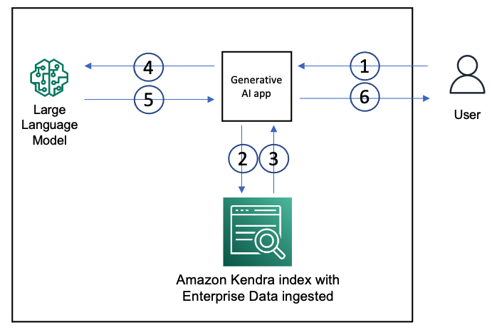

# Amazon Kendra RAG with Falcon 7B Instruct Foundation Model

> The lab is based on Github repo [amazon-kendra-langchain-extensions
](https://github.com/aws-samples/amazon-kendra-langchain-extensions), which is the sample code of AWS Blog - [Quickly build high-accuracy Generative AI applications on enterprise data using Amazon Kendra, LangChain, and large language models](https://aws.amazon.com/blogs/machine-learning/quickly-build-high-accuracy-generative-ai-applications-on-enterprise-data-using-amazon-kendra-langchain-and-large-language-models/)

## TL;DR;
The purpose of the document is to provide guidance on demonstrating Amazon Kendra RAG integration with Falcon 7B Instruct foundation model.

## Solution overview

The following diagram shows the architecture of a GenAI application with a RAG approach.



We use an Amazon Kendra index to ingest enterprise unstructured data from data sources such as wiki pages, MS SharePoint sites, Atlassian Confluence, and document repositories such as Amazon S3. When a user interacts with the GenAI app, the flow is as follows:

1. The user makes a request to the GenAI app.
2. The app issues a search query to the Amazon Kendra index based on the user request.
3. The index returns search results with excerpts of relevant documents from the ingested enterprise data.
4. The app sends the user request and along with the data retrieved from the index as context in the LLM prompt.
5. The LLM returns a succinct response to the user request based on the retrieved data.
6. The response from the LLM is sent back to the user.

The the lab, we choose [Falcon 7B Instruct](https://huggingface.co/tiiuae/falcon-7b-instruct) LLM and deploy it on Amazon SageMaker Real-time Inference endpoint (with ml.g5.2xlarge). 

## Deployment Process

### Step 1. Amazon Kendra Stack Deployment

Please create a CloudFormation stack with [kendra-docs-index.yaml](./kendra-docs-index.yaml). 
* The deployment may take approx. 45mins to provision Kendra index and loading a sample data source of Amazon services (Amazon SageMaker, Amazon Kendra & Amazon Lex) development guidance.
* In the stack, there is a S3 bucket data source, which you may trial uploading file to the bucket.

* Setup the environment variables.
```shell
# assume you are running the app in us-east-1 region.
export AWS_REGION="us-east-1"

# the cloudformation stack name
export STACK_NAME=sagemaker-llm-kendra-rag-stack

```

* Create CloudFormation stack

> The cloudformation stack creation may take up to 45mins - 60mins.

```shell
aws cloudformation create-stack \n
    --stack-name $STACK_NAME
    --template-body file://kendra-docs-index.yaml
```

### Step 2. Deploy Falcon 7B Instruct Model

If you've completed lab1, you should have a endpoint ready. Otherwise, please execute the related steps in lab1 notebook, e.g. [lab1-depploy_opensource_llms_on_amazon_sagemaker_FILLIN.ipynb](../lab1-depploy_opensource_llms_on_amazon_sagemaker_FILLIN.ipynb) or the refer to the [solution notebook - lab1-depploy_opensource_llms_on_amazon_sagemaker.ipynb](../solutions/lab1-depploy_opensource_llms_on_amazon_sagemaker.ipynb)

Please note down the Real-time endpoint name and setup below environment variable.

```shell
# please replace below with the actual name
export SAGEMAKER_LLM_ENDPOINT="falcon-7b-instruct-2xl"
```

## Verifying new data source

To test Amazon Kendra RAG integration with LLM on new documents, please choose documents (PDF/TXT/Doc...) and upload to the S3 bucket. e.g. PDF files from [Important information - personal documents](https://www.commbank.com.au/important-info/personal.html#pii-personal-lending). 

For uploading file(s), please use the upload button in the chat streamlit app, and then execute below steps to kick off the sync-job:

* Collect the resource name and ID

```shell
KENDRA_INDEX_ID=$(aws cloudformation describe-stacks \
    --stack-name $STACK_NAME \
    --region $AWS_REGION --query 'Stacks[0].Outputs[?OutputKey==`KendraIndexID`].OutputValue' --output text)
echo "Kendra Index ID: ${KENDRA_INDEX_ID}"

KENDRA_DOC_S3_DS_ID=$(aws cloudformation describe-stacks \
    --stack-name $STACK_NAME \
    --region $AWS_REGION --query 'Stacks[0].Outputs[?OutputKey==`KendraDocsS3DSID`].OutputValue' --output text)
echo "Kendra Doc S3 Data Source ID: ${KENDRA_DOC_S3_DS_ID}"

KENDRA_DOC_S3_BUCKET=$(aws cloudformation describe-stacks \
    --stack-name $STACK_NAME \
    --region $AWS_REGION --query 'Stacks[0].Outputs[?OutputKey==`KendraDocsS3BucketName`].OutputValue' --output text)
echo "Kendra Doc S3 Bucket Name: ${KENDRA_DOC_S3_DS_ID}"
```

* Kick off the data source sync job.

> It may take 5-10mins minutes to complte the data source sync job for

```shell
SYNC_JOB_EXECUTION_ID=$(aws kendra start-data-source-sync-job \
    --id $KENDRA_DOC_S3_DS_ID \
    --index-id $KENDRA_INDEX_ID \
    --region $AWS_REGION \
    --query 'ExecutionId' --output text)
echo $SYNC_JOB_EXECUTION_ID
```

***Once the sync up job finishes, please go back to chat streamlit app and start asking relevant questions on the new documents.***